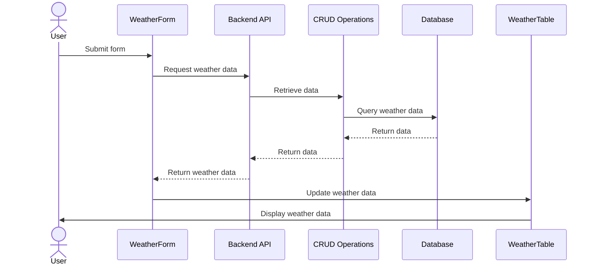

## Weather Data app
<video src="docs/weather-app.mp4" controls="controls" style="max-width: 100%;"></video>

### Sequence Diagram

### Metrics and Alerts

In order to ensure the application is reliable we would need to mesure the application stats
when running correctly. In that way we can be proactive and detect if some part is wrong.
For example:
1. API response time.
2. Database queries execution time.
3. Hardware metrics. CPU + RAM.
4. Downtime.
5. Data freshness.
6. Requests overload.

Alerts on specific situations:
1. 3rd party service failing. In this case AEMET API.
2. Responses failing.
3. Database connection lost or queries failing.
4. App server or database down.

### Avoid unnecessary requests to AEMET API

A simple system has been implemented, just before making a request I check if the
data has been updated less than hour ago, to prevent extra requests when the data
isn't updated in AEMET's API.
I check as well that the requested end datetime is newer than the last update datetime in that case we likely can provide it from the database.

A more robust system could be having a cronjob or a Celery worker fetching the data and storing it to the database, then the service, isn't in charge of making the requests to AEMET's API.

### Improve requests

1. Increase amount of workers.
2. API and DB caching.
3. Load balancer for quicker response. Allocating the server that will reply quicker.
4. Introduce asynchrony, liberating resources for instance when we send a request
   to the AEMET API.
5. Horizontal vs Vertical scaling.

### Authentication

1. Managed in the app. JWT is a common solution.
2. BaaS like Firebase can provide a secure and simple way of authenticating providing a wide scope of authentication methods, email+password, Google sign-in, ..

### Authorization

We could use roles permissions, for instance an admin could be triggering a request
to AEMET API, and a regular user would follow the current logic fetching data only the current conditions, certain time after the data was lastly updated.
